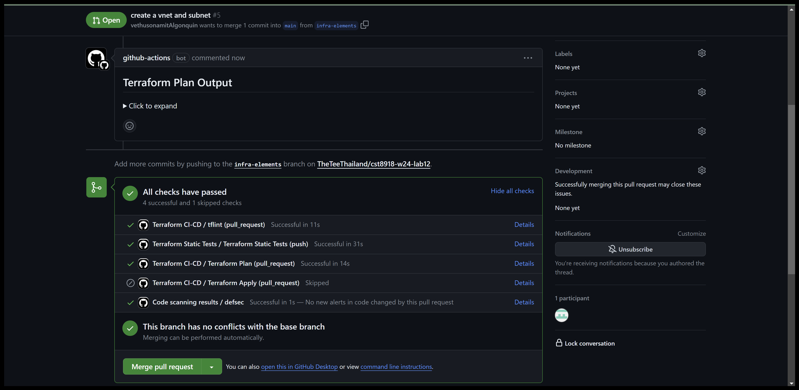
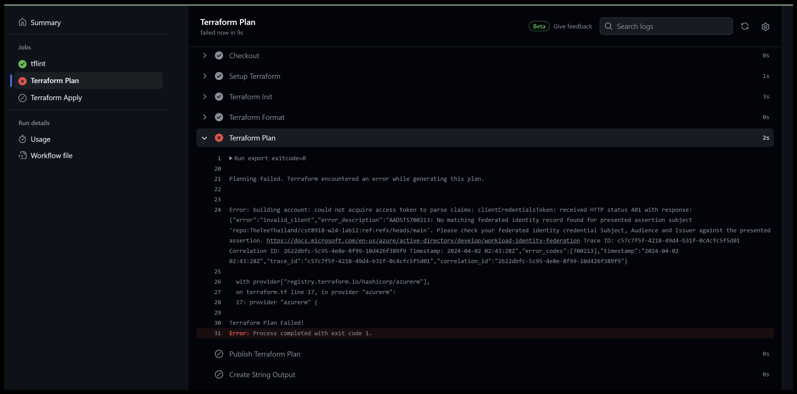

# cst8918-w24-lab12

|Student Name | Student number | Student Email|
|---|---|---|
|Vethuson Amit | 041109985| amit0004@algonquinlive.com|
|Thep Rungpholsatit | 041066248 | rung0018@aglonquinlive.com|

## Pull Request Checks

## Merge request Checks

## Conclusion
While working on this lab, we encountered an issue while merging with the main branch. It's strange because creating a pull request for the Terraform plan was successful, but after merging it into the main branch, the Terraform plan failed. Unfortunately, we couldn't pinpoint the cause of this problem, but we're eager to investigate and find a solution.